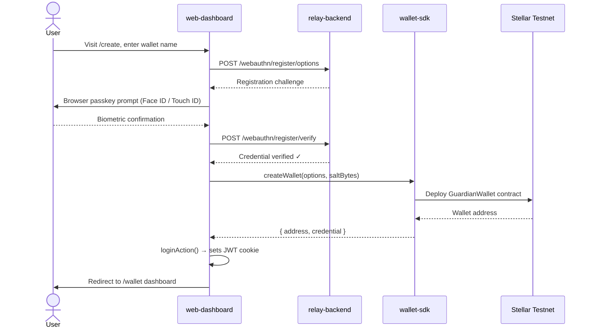
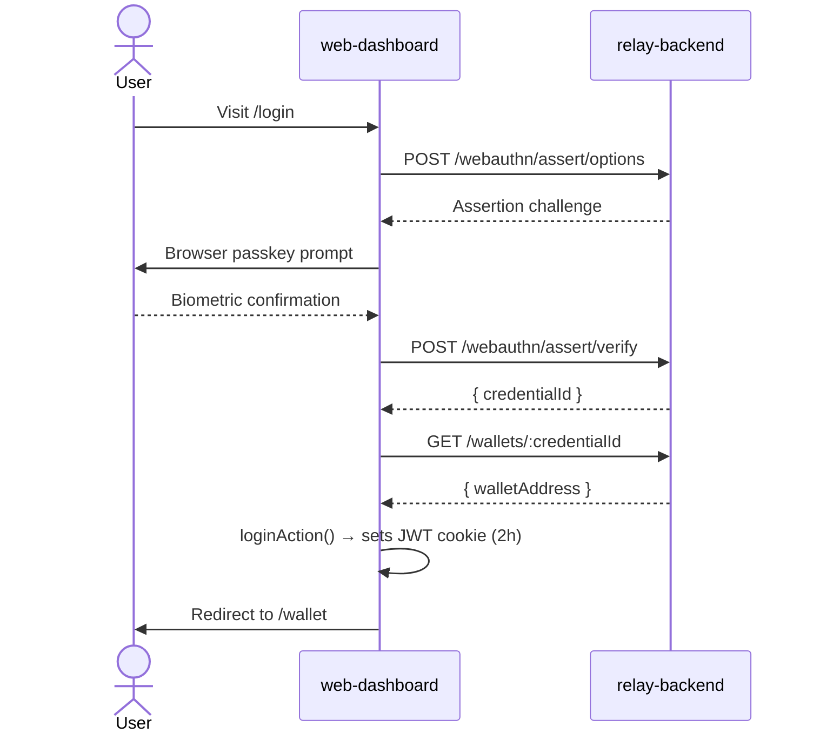
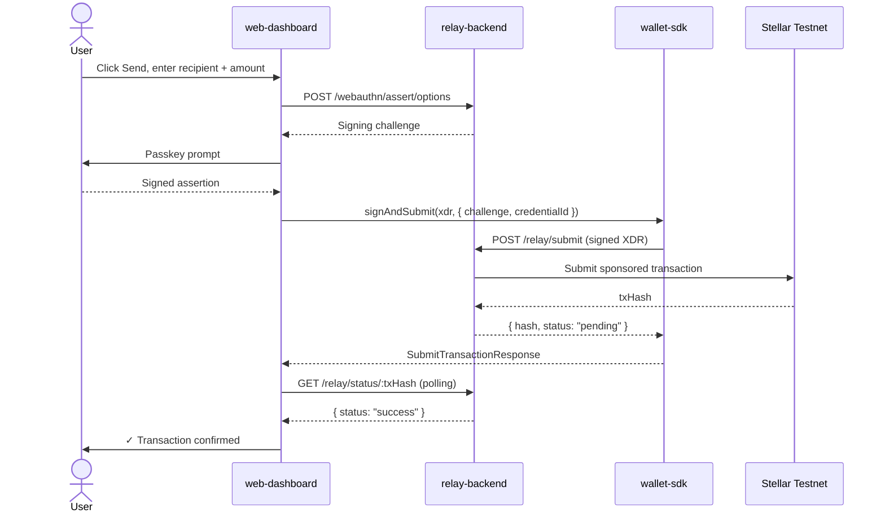

<div align="center">
  

  <h1>Guardian Wallet — Web Dashboard</h1>

  <p>
    A passkey-powered Stellar smart wallet with on-chain policies and social recovery.<br/>
    No seed phrases. No passwords. Just your biometrics.
  </p>

  <p>
    <a href="https://guardian-wallet-web.vercel.app">
      
    </a>
    
    
    
    
    
    
    
    <a href="https://github.com/Rayos-Org/web-dashboard/actions">
      
    </a>
    <a href="LICENSE">
      
    </a>
  </p>

  <p>
    <a href="https://rayos-stellar-frontend.vercel.app"><strong>🚀 Live Demo</strong></a> ·
    <a href="docs/SETUP.md"><strong>📖 Setup Guide</strong></a> ·
    <a href="docs/ARCHITECTURE.md"><strong>🏛️ Architecture</strong></a> ·
    <a href="docs/CONTRIBUTING.md"><strong>🤝 Contributing</strong></a> ·
    <a href="https://github.com/Rayos-Org/web-dashboard/issues/new/choose"><strong>🐛 Report a Bug</strong></a>
  </p>
</div>

---

## What is Guardian Wallet?

Guardian Wallet is an open-source **Stellar smart wallet** secured entirely by passkeys (WebAuthn). Users create a wallet by scanning their face or fingerprint — no seed phrases, no passwords, nothing to back up and nothing to steal.

The wallet is deployed as a Soroban smart contract on the Stellar blockchain. All policies — spend limits, session keys, contract allow-lists — are enforced **on-chain**, not in application logic that can be bypassed. If you lose your device, a pre-configured set of guardian signers can collectively approve a recovery that installs your new passkey as the wallet's authorised signer.

This repository (`web-dashboard`) is the **Next.js frontend** — the face of the product. It talks to three other services in the Rayos ecosystem.

---

## Rayos Ecosystem

Guardian Wallet is built across four repositories. Here's how they connect:

```
┌────────────────────────────────────────────────────────────────┐
│               User's Browser / Mobile                           │
│          web-dashboard  ← you are here                         │
│    Next.js 16 · React 19 · shadcn/ui · @rayos/wallet-sdk      │
└──────────────────────────┬─────────────────────────────────────┘
                           │  /api/* proxy (no CORS, cookie-safe)
                           ▼
┌────────────────────────────────────────────────────────────────┐
│                    relay-backend (NestJS)                        │
│   WebAuthn · Fee Relay · Indexer · Sessions · Recovery          │
└────────────────┬───────────────────────────────────────────────┘
                 │  Soroban XDR + RPC calls
                 ▼
┌────────────────────────────────────────────────────────────────┐
│              wallet-contracts (Soroban / Rust)                   │
│        GuardianWallet · PolicyModule · RecoveryModule            │
└────────────────────────────────────────────────────────────────┘
```

| Repository | Description |
|---|---|
| **[`web-dashboard`](https://github.com/Rayos-Org/web-dashboard)** (this) | Next.js frontend — the UI, API proxy, and passkey flows |
| **[`relay-backend`](https://github.com/Rayos-Org/relay-backend)** | NestJS backend — WebAuthn ceremony, fee sponsorship, session & recovery management |
| **[`wallet-contracts`](https://github.com/Rayos-Org/wallet-contracts)** | Soroban smart contracts — wallet logic, spend limits, social recovery |
| **[`infra`](https://github.com/Rayos-Org/infra)** | Terraform IaC — Vercel, Render, NeonDB, Cloudflare |

---

## Features

### 🔑 Passkey-Powered Authentication
- Create a wallet by registering a WebAuthn passkey (Face ID, Touch ID, Windows Hello) — no seed phrase is ever generated
- Sign in on any device by asserting the passkey — no password reset flows
- Every sensitive action (send, set policy, add guardian) requires a fresh passkey assertion

### 💸 Send & Receive XLM
- Live balance from the Soroban smart contract via `@rayos/wallet-sdk`
- Real-time transaction history from the Stellar Horizon API with icons, amounts, and explorer links
- Account funding via Stellar Friendbot (testnet)

### 🛡️ On-Chain Spend Policies
- **Spend Limits** — rolling per-time-window XLM cap enforced by the contract's policy module
- **Session Keys** — ephemeral sub-keys scoped to specific contracts, authorized with a passkey signature
- **Contract Allow-List** — whitelist of Stellar contracts the wallet can interact with

### 👥 Social Recovery
- Configure trusted guardian signers with configurable weights (M-of-N threshold)
- Lost your device? Initiate recovery from a new device — generates a new passkey and proposes it to your guardians
- Guardians approve via a shareable link — no app download required
- Timelock and approval status polled in real time

### 🎨 UI / UX
- Dark + light mode, Geist Sans + Geist Mono, Amber accent (`#D97706`)
- Skeleton loaders, empty states with clear CTAs, toast notifications
- Responsive — works on mobile and desktop

---

## File Architecture

```
web-dashboard/
├── app/                      ← Next.js App Router
│   ├── (onboarding)/         ← Public flows: create, login, recover
│   ├── (dashboard)/          ← Protected: wallet, policies, guardians
│   ├── api/                  ← Route Handlers proxying to relay-backend
│   └── actions/              ← Server Actions (login/logout)
│
├── components/
│   ├── ui/                   ← shadcn/ui primitives — never edited directly
│   ├── wallet/               ← BalanceCard, QuickSend, TransactionList, SignersCard
│   ├── policies/             ← SpendLimitForm, SessionKeyList, AllowListEditor
│   └── guardians/            ← GuardianList, RecoveryStatusBanner
│
├── hooks/                    ← All data fetching (React Query + SDK)
│   ├── useWallet.ts          ← Wallet state, send transaction
│   ├── usePolicies.ts        ← Session keys CRUD
│   ├── useRecovery.ts        ← Recovery proposal lifecycle
│   └── useTransactions.ts    ← Horizon API: history, account status
│
├── lib/                      ← Shared utilities
│   ├── auth.ts               ← JWT session (jose)
│   ├── config.ts             ← Zod-validated env vars
│   ├── proxy.ts              ← Generic relay-backend proxy
│   └── sdk-client.ts         ← WalletSdk singleton
│
├── docs/                     ← Contributor documentation
│   ├── ARCHITECTURE.md       ← Deep-dive into structure and decisions
│   ├── SETUP.md              ← Local development guide
│   ├── CONTRIBUTING.md       ← How to contribute
│   ├── TESTING.md            ← Testing strategy and guide
│   ├── SECURITY.md           ← Vulnerability reporting
│   └── CODE_OF_CONDUCT.md
│
└── .github/
    ├── workflows/ci.yml      ← TypeScript · ESLint · Vitest · Playwright
    ├── ISSUE_TEMPLATE/       ← Bug, feature, docs templates
    └── PULL_REQUEST_TEMPLATE.md
```

> **Full annotated structure:** [docs/ARCHITECTURE.md → Directory Structure](docs/ARCHITECTURE.md#3-directory-structure)

---

## User Workflow

### New User — Wallet Creation



### Returning User — Sign In



### Sending a Transaction



---

## System Architecture

```mermaid
graph TB
    subgraph Browser["🌐 Browser (web-dashboard)"]
        direction TB
        LP[Landing Page] --> Create[/create — Wallet Creation]
        LP --> Login[/login — Passkey Sign In]
        LP --> Recover[/recover — Lost Device Recovery]

        Create --> Dashboard
        Login --> Dashboard

        subgraph Dashboard["Protected Dashboard"]
            W["/wallet — Balance + History"]
            P["/policies — Spend Limits, Sessions, Allow-list"]
            G["/guardians — Guardian Management"]
        end

        Dashboard --> Hooks["hooks/* — React Query"]
        Hooks --> SDK["@rayos/wallet-sdk"]
        Hooks --> APIProxy["app/api/* — Route Handlers"]
        Hooks --> Horizon["Horizon API (tx history)"]
    end

    subgraph Backend["☁️ relay-backend (NestJS · Render)"]
        WA["WebAuthn Module"]
        RL["Relay Module — Fee Sponsorship"]
        IDX["Indexer Module — Credential→Address"]
        SESS["Sessions Module"]
        REC["Recovery Module"]
    end

    subgraph Contracts["⛓️ Stellar Testnet (Soroban)"]
        GW["GuardianWallet Contract"]
        PM["PolicyModule Contract"]
        RM["RecoveryModule Contract"]
    end

    APIProxy -->|HTTP JSON| Backend
    SDK -->|Soroban XDR + RPC| Contracts
    RL -->|Signed XDR| Contracts
    Horizon -->|REST| Contracts
```

---

## Tech Stack

| | Technology |
|---|---|
| **Framework** | Next.js 16 (App Router) + React 19 |
| **Language** | TypeScript 5 (strict) |
| **Styling** | Tailwind CSS v4 + shadcn/ui |
| **Server State** | TanStack React Query v5 |
| **Local State** | Zustand |
| **Passkeys** | `@simplewebauthn/browser` |
| **Session** | JWT in httpOnly cookie (`jose`) |
| **Wallet SDK** | `@rayos/wallet-sdk` |
| **Blockchain** | Stellar (Soroban / Testnet) |
| **Unit Tests** | Vitest + Testing Library |
| **E2E Tests** | Playwright (Chromium, Firefox, WebKit) |
| **CI** | GitHub Actions |
| **Deployment** | Vercel |
| **Package Manager** | pnpm 9 |

---

## Testing

```bash
pnpm test --run      # Unit + component tests (Vitest)
pnpm test:e2e        # End-to-end tests (Playwright, 3 browsers)
pnpm tsc --noEmit    # TypeScript strict check
pnpm lint            # ESLint
pnpm build           # Production build (zero warnings = CI gate)
```

| Layer | Tool | Coverage |
|---|---|---|
| Component / Unit | Vitest + Testing Library | Form validation, hook states, passkey flows |
| End-to-End | Playwright | Onboarding flow, dashboard navigation |
| Type safety | TypeScript `strict` | Every file — no `any` without justification |

> Full testing guide: [docs/TESTING.md](docs/TESTING.md)

---

## Getting Started

```bash
# 1. Clone
git clone https://github.com/Rayos-Org/web-dashboard.git
cd web-dashboard

# 2. Install
pnpm install

# 3. Configure
cp .env.local.example .env.local
# → edit .env.local with your relay-backend URL and contract IDs

# 4. Run
pnpm dev
# → http://localhost:3000
```

> **Complete setup guide with troubleshooting:** [docs/SETUP.md](docs/SETUP.md)

---

## Environment Variables

| Variable | Description |
|---|---|
| `NEXT_PUBLIC_RELAY_BACKEND_URL` | URL of the deployed relay-backend |
| `NEXT_PUBLIC_WEBAUTHN_RP_ID` | Your domain (must match exactly — use `localhost` for dev) |
| `NEXT_PUBLIC_FACTORY_CONTRACT_ID` | Stellar wallet factory contract address |
| `NEXT_PUBLIC_POLICY_CONTRACT_ID` | Stellar policy module contract address |
| `NEXT_PUBLIC_SOROBAN_RPC_URL` | Soroban RPC endpoint |
| `NEXT_PUBLIC_STELLAR_NETWORK_PASSPHRASE` | Stellar network identifier |
| `SESSION_SECRET` | Server-side JWT secret (≥ 32 chars, never commit) |

---

## Deploying to Vercel

[](https://vercel.com/new/clone?repository-url=https://github.com/Rayos-Org/web-dashboard)

1. Click the button above — or import the repo manually at [vercel.com/new](https://vercel.com/new)
2. Add all environment variables in the Vercel Project Settings
3. Set `NEXT_PUBLIC_WEBAUTHN_RP_ID` to your **production domain** (e.g., `rayos-stellar-frontend.vercel.app`)
4. Deploy

> The live deployment is at **[rayos-stellar-frontend.vercel.app](https://rayos-stellar-frontend.vercel.app)**

---

## Documentation

| Document | Description |
|---|---|
| [docs/SETUP.md](docs/SETUP.md) | Local development setup, env vars, troubleshooting |
| [docs/ARCHITECTURE.md](docs/ARCHITECTURE.md) | Codebase structure, design decisions, request lifecycles |
| [docs/CONTRIBUTING.md](docs/CONTRIBUTING.md) | How to contribute, coding conventions, PR process |
| [docs/TESTING.md](docs/TESTING.md) | Testing strategy, how to write tests, CI pipeline |
| [docs/SECURITY.md](docs/SECURITY.md) | Vulnerability reporting and security policy |
| [docs/CODE_OF_CONDUCT.md](docs/CODE_OF_CONDUCT.md) | Community standards |

---

## Contributing

We welcome contributions of all kinds — bug reports, feature ideas, documentation fixes, and code.

1. **Find an issue** — browse [open issues](https://github.com/Rayos-Org/web-dashboard/issues), especially ones labelled [`good first issue`](https://github.com/Rayos-Org/web-dashboard/issues?q=label%3A%22good+first+issue%22)
2. **Set up your environment** — follow [docs/SETUP.md](docs/SETUP.md)
3. **Read the conventions** — read [docs/CONTRIBUTING.md](docs/CONTRIBUTING.md) before writing code
4. **Open a PR** — use the PR template, link the issue, fill in every section

> ⚠️ **No mock data rule:** The codebase must contain zero dummy/placeholder data in production paths. Every data point shown to the user must come from a real API or on-chain source. See [docs/CONTRIBUTING.md → No Mock Data](docs/CONTRIBUTING.md#no-mock-data).

---

## License

[MIT](LICENSE) — Copyright © 2026 Rayos Org contributors.

---

<div align="center">
  <p>
    Built with ❤️ by the <a href="https://github.com/Rayos-Org">Rayos Org</a> team<br/>
    Powered by <a href="https://stellar.org">Stellar</a> · <a href="https://soroban.stellar.org">Soroban</a> · <a href="https://passkeys.dev">Passkeys</a>
  </p>
  <p>
    <a href="https://github.com/Rayos-Org/web-dashboard/stargazers">⭐ Star this repo</a> if you find it useful!
  </p>
</div>
